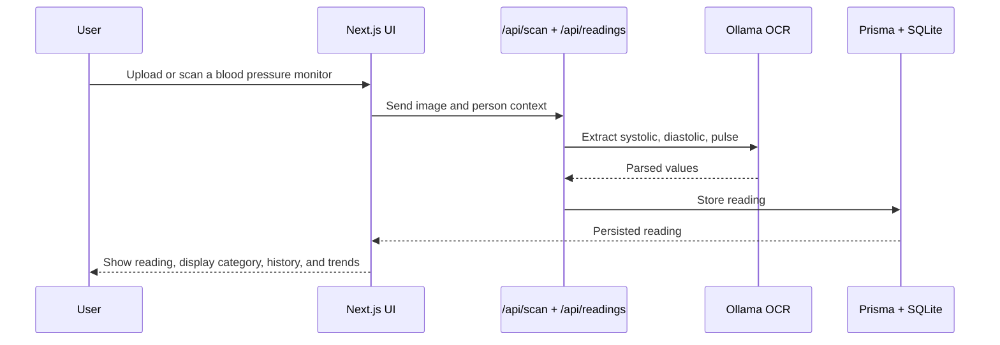

# 🩺 Blodtryk

Danish blood pressure tracking app with AI-powered OCR. Photograph your blood pressure monitor and let AI read the numbers automatically.

## Screenshots

| Trends | Readings |
|--------|----------|
|  |  |

## Features

- **📷 Camera Scan** — Point your phone camera at a blood pressure monitor, AI reads the values
- **📁 Batch Upload** — Upload multiple photos at once for batch processing
- **👤 Multi-User** — Track blood pressure for multiple family members
- **📊 Blood-Pressure Categories** — Versioned, informational categories based on DCS NBV table 27.1; see scope and caveats below
- **📄 PDF Export** — Generate professional reports with color-coded status
- **📈 Trends** — Charts of systolic/diastolic/pulse over time
- **💊 Medications** — Track medications per person alongside readings
- **🔔 Daily Reminder** — Browser notification when it is time to measure
- **✏️ Manual Editing** — Correct or enter readings by hand
- **🎨 Dark Mode** — Light / dark / system theme
- **🌙 PWA** — Install on your phone's home screen

## Classification scope

The app's display categories use the thresholds in the Danish Society of Cardiology (DCS) National Treatment Guideline for arterial hypertension, revision 2026/4, table 27.1. The source defines categories for daytime averages from home or ambulatory monitoring, or unattended automated clinic measurements when those methods are not possible. This app applies the table to individual saved readings and report-period arithmetic means for display only. The adaptation has not been clinically reviewed or validated and is not a diagnosis, treatment target, or triage tool. The app does not adjust categories by age or provide patient-specific targets. DCS notes that systolic blood pressure below 120 mmHg may be too low for older adults; the app does not assess that note.

Rule metadata: `dcs-nbv-2026-4-table-27-1-v1` (verified 2026-09-23). The exact thresholds and comparison behavior are documented in [BP documentation](docs/BP%20documantation.md). Official source: [DCS NBV, arterial hypertension](https://nbv.cardio.dk/kapitel/hypertension/).

## Internationalization

The app supports **Danish** (default) and **English**.

- Switch language with the toggle in the navbar; the choice is stored in `localStorage` (`lang`)
- On first visit the browser language is detected (`da*` → Danish, `en*` → English)
- All UI strings live in the dictionaries in `src/lib/i18n.ts` and are read through the `useI18n()` hook (`t`, `tError`, `countKey`)
- API routes return bare error codes; they are translated client-side with `tError`
- A pre-paint script in `src/app/layout.tsx` sets `<html lang>` before first render (no screen-reader flash)
- **Limitation:** static metadata (page title/description) is defined at build time and stays Danish

## Tech Stack

- **Frontend:** Next.js 16, React 19, TypeScript, Tailwind CSS
- **Backend:** Next.js API Routes, Prisma ORM
- **Database:** SQLite (SQLite-compatible for easy deployment)
- **AI:** Ollama with vision model (glm-ocr) for blood pressure reading
- **PDF:** jsPDF for client-side report generation

## Getting Started

### Prerequisites

- Node.js 20+
- Ollama running locally with `glm-ocr` model

### Installation

```bash
# Clone the repository
git clone https://github.com/japperJ/blodtryk.git
cd blodtryk

# Install dependencies
npm install

# Set up database
npx prisma db push

# Start development server
npm run dev
```

### Environment Variables

Create a `.env` file:

```env
DATABASE_URL="file:./dev.db"
OLLAMA_HOST="http://localhost:11434"
OLLAMA_MODEL="glm-ocr"
```

### Available Scripts

```bash
npm run dev      # Start dev server on port 3010 with HTTPS (required for camera)
npm run build    # Build for production
npm start        # Start production server on port 3010
npx prisma db push       # Apply schema changes to SQLite (also `npm run db:push`)
npm run db:studio        # Open Prisma Studio
npm run test:classification # Test classification boundaries and metadata
```

## Usage

1. **First time:** Go to 👤 Persons and create your first person
2. **Scan:** Select a person, then use 📷 Camera or 📁 Upload
3. **View:** Check 📋 Measurements for history with color-coded status
4. **Export:** Generate 📄 PDF reports for your doctor

## System Overview

This app is a Next.js blood pressure tracking system: the user scans a monitor reading, the app extracts the values with an OCR model, stores the measurement, and presents trends, classifications, and reports.



## Project Structure

```
blodtryk/
├── prisma/
│   └── schema.prisma        # Database schema
├── scripts/
│   └── migrate-images.mjs   # One-off image migration helper
├── src/
│   ├── app/
│   │   ├── api/             # API routes
│   │   ├── scan/            # Camera & batch upload
│   │   ├── readings/        # History view
│   │   ├── trends/          # Charts & statistics
│   │   └── persons/         # Multi-user management
│   ├── components/          # React components
│   ├── lib/                 # Utilities (OCR, BP classification, i18n)
│   └── hooks/               # Custom React hooks
├── docs/                    # Design docs & plans
└── public/                  # PWA manifest, icons & service worker
```

## License

MIT — see [LICENSE](LICENSE).
